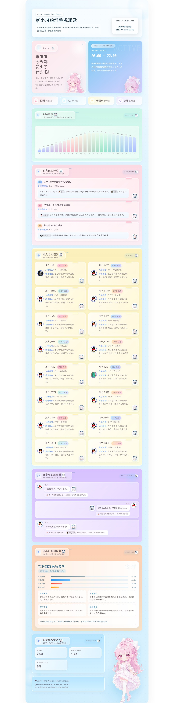

# jx3_qban 群聊日报主题（唐小珂 Q版）

适配 [astrbot_plugin_qq_group_daily_analysis](https://github.com/SXP-Simon/astrbot_plugin_qq_group_daily_analysis)
的独立报告模板包，基于 ATRI 布局，唐小珂 Q版 主题。



## 安装

### 方式一：WebUI 一键安装（推荐）

1. 打开 AstrBot WebUI → 插件配置中心 → 报告模板 → 安装模板
2. 切到 GitHub 标签页，填入本仓库地址：

   ```text
   https://github.com/muqing-kg/astrbot-template-jx3-qban
   ```

3. 安装完成后无需重启，模板下拉列表里会出现 `jx3_qban_txk`（显示名「唐小珂Q版」）

### 方式二：ZIP 上传安装

下载本仓库 ZIP（Code → Download ZIP），在同一个弹窗的 ZIP 标签页上传即可。

### 方式三：手动放置

把 `jx3_qban_txk/` 整个目录放到插件数据目录下：

```text
data/plugin_data/astrbot_plugin_qq_group_daily_analysis/custom_t2i_templates/reporting_templates/
```

## 说明

- 安装后的模板名由模板目录名决定，即 `jx3_qban_txk`；如需改名，重命名目录即可。
- 贴图自持于本仓库 `assets/jx3_qban/`，通过 jsDelivr CDN 分发（钉在固定 commit），渲染时需要网络。
- `assets/` 位于模板目录之外，不计入安装包体积；单独下载模板目录即得轻量包。
- 同时包含图片长图（`image_template.html`）与网页日报（`html_template.html`）两个入口。
- 内置模板已有 `jx3_qban` 的插件（本模板的上游 fork）装载本包时不会冲突，因为模板名为 `jx3_qban_txk`。

## 致谢

- 插件本体：[SXP-Simon/astrbot_plugin_qq_group_daily_analysis](https://github.com/SXP-Simon/astrbot_plugin_qq_group_daily_analysis)
- 模板结构参考：[lingyun14beta/daily-analysis-report-theme](https://github.com/lingyun14beta/daily-analysis-report-theme)
- 原主题维护：[muqing-kg/astrbot_plugin_qq_group_daily_analysis](https://github.com/muqing-kg/astrbot_plugin_qq_group_daily_analysis) 的 `wechat-avatar` 分支
